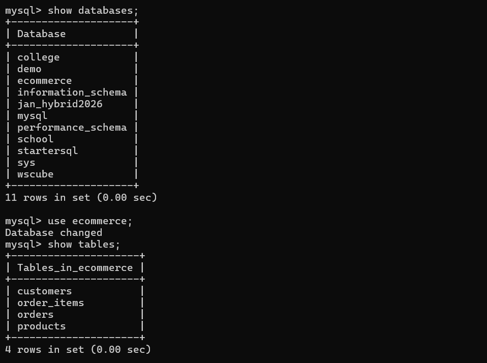
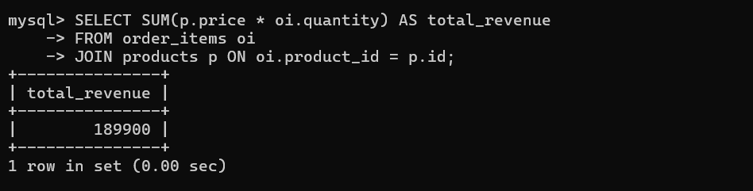
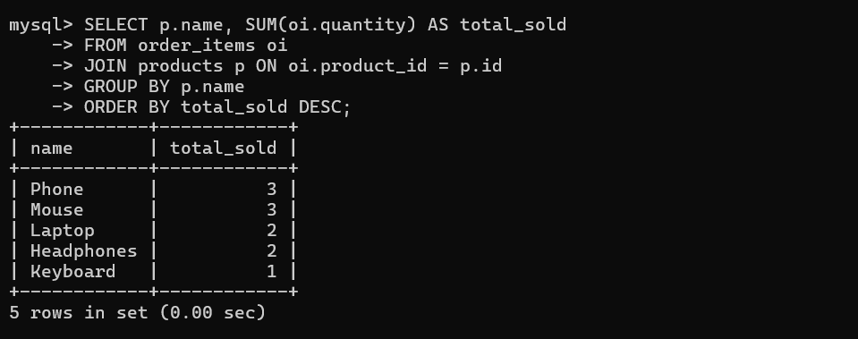

# E-Commerce Analytics System(SQL Project)

## 📌 Overview
This project analyzes customer orders, product performance, and revenue using SQL.

## ⚙️ Tech Stack
- MySQL
- SQL (Joins, Aggregations, Group By)

## 📊 Features
- Total revenue calculation
- Top-selling products
- Customer behavior analysis
- Monthly order trends

## 📁 Files
- schema.sql → database structure
- data.sql → sample data
- queries.sql → analysis queries

## 🚀 How to Run
1. Run schema.sql
2. Run data.sql
3. Run queries.sql

## 💡 Key Learnings
- Writing complex SQL queries
- Data analysis using SQL
- Database design basics

- ## 📸 Project Screenshots

### 🧾 Tables Created

### 💰 Total Revenue

### 🏆 Top Selling Products

